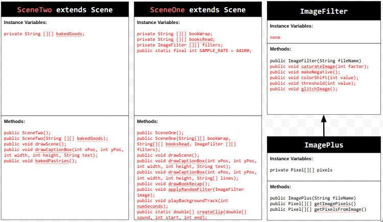

# Personal-Narrative
# Unit 5 - Personal Narrative / Interest Animation

## Introduction

Images are often used to portray our personal experiences and interests. We also use image filters and effects to change or enhance the mood of an image. When combined into collages and presentations, these images tell a story about who we are and what is important to us. Your goal is to create an animation using The Theater and Scene API that consists of images of your personal experiences and/or interests. In this animation, you will incorporate data related to these experiences and/or interests that can be organized in a 2D array, and use image filters and effects to change or enhance the mood of your images.
## Requirements

Use your knowledge of object-oriented programming, two-dimensional (2D) arrays, and algorithms to create your personal narrative collage or animation:
- **Write Scene subclasses** – Create two Scene subclasses: either two core parts of your personal life, or two components of a personal interest. Each class must contain a constructor and private instance variable with data related to the scene
- **Create at least two 2D arrays** – Create at least two 2D arrays to store the data that will make up your visualization.
Implement algorithms – Implement one or more algorithms that use loops and logic that operate on the data in your 2D arrays.
- **Create a visualization** – Create an animation that conveys the story of the data by illustrating the patterns or relationships in the data.
- **Image Filters** – Utilize the image filters created in this unit (and possible new filters) that show a personal flare to the images used in your animation.
- **Document your code** – Use comments to explain the purpose of the methods and code segments and note any preconditions and postconditions.

## UML Diagram

Put an image of your UML Diagram here. Upload the image of your UML Diagram to your repository, then use the Markdown syntax to insert your image here. Make sure your image file name is one work, otherwise it might not properly get displayed on this README.

## Video

Record a short video of your story to display here on your README. You can do this by:

- Screen record your project running on Code.org.
- Upload that recording to YouTube.
- Take a thumbnail for your image.
- Upload the thumbnail image to your repo.
- Use the following markdown

## Story Description

In my personal narrative, I wanted to showcase my personal interests of reading and baking. When the program is run it will display the books I read last year, broken down by month and pastries I've baked over the years broken down by cateoriges. My book 2D array is made up of rows that represent book titles and months respectively. My pastries 2D array is made up of rows that represent pastries and their cateoriges. Through this data I can access and traverse to display their images in the interface.

## Image Filter Analysis

One of the filters I used in my animation was a saturate filter. The saturate filter, with an int parameter called factor, stored the pixels of the images into a 2D called pixels. Then it goes through each row and column of the pixels 2D array. Next it finds the average brightness, using it as a reference point. Finding the greyscale value controls how strong the saturation effect is, (avg - 255) measures how far from white and multiplying it by the factor scales the distance. Adding back avg creates a new reference value. When factor is -1, it will always become 255. I multiply on the greyscale by 2 because I want the orginal color to be reflected across the greyscale reference point, which changes the intensity when subtracting the color value. This updates RGB values, applying the saturation factor. 

In my animation I also applied a glitch filter to my images. This was done by traversing through the 2D array called pixels. Then using Math.random, to get a random number between 1-255 for the RGB values. With the newRed values I add them to the currentPixels.getRed(), getGreen(), and getBlue() to get final respective colors. Next, I put the RBG values through an if-statement. If the final colors is greater than 255 than the final color equals 255. Else if the final color is less than 0 the final color equals 0. After, the current pixels are set to their respective final color values. 
